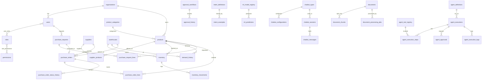

# ER Diagram (core)

```mermaid
erDiagram
  organizations ||--o{ users : has
  users }o--o{ roles : user_roles
  roles }o--o{ permissions : role_permissions
  organizations ||--o{ products : owns
  product_categories ||--o{ products : categorises
  products ||--o{ supplier_products : offered_as
  suppliers ||--o{ supplier_products : supplies
  warehouses ||--o{ inventory : stores
  products ||--o{ inventory : stocked_as
  inventory ||--o{ inventory_movements : logs
  products ||--o{ demand_history : demand
  warehouses ||--o{ demand_history : at
  suppliers ||--o{ purchase_orders : receives
  warehouses ||--o{ purchase_orders : delivers_to
  purchase_orders ||--o{ purchase_order_lines : contains
  products ||--o{ purchase_order_lines : ordered
  purchase_orders ||--o{ purchase_order_status_history : tracks
  users ||--o{ purchase_requests : requests
  purchase_requests ||--o{ purchase_request_lines : contains
  products ||--o{ purchase_request_lines : requested
  purchase_requests ||--o| purchase_orders : converted_to
  approval_workflows ||--o{ approval_history : records
  chatbot_types ||--o{ chatbot_configurations : configured
  chatbot_types ||--o{ chatbot_sessions : used_in
  chatbot_sessions ||--o{ chatbot_messages : holds
  intent_definitions ||--o{ intent_examples : trained_by
  ml_model_registry ||--o{ ml_predictions : produced
  documents ||--o{ document_chunks : split_into
  documents ||--o{ document_processing_jobs : processed_by
  agent_definitions ||--o{ agent_executions : run_as
  agent_executions ||--o{ agent_execution_steps : has
  agent_executions ||--o{ agent_approvals : requires
  agent_executions ||--o{ agent_execution_logs : logs
  agent_tool_registry ||--o{ agent_execution_steps : invoked
```
